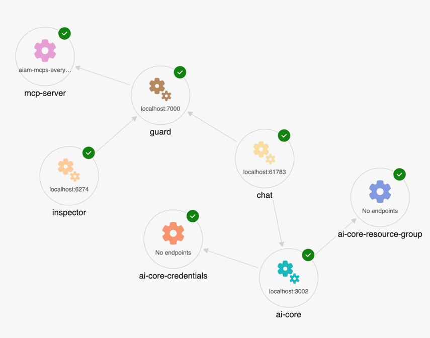

# Agent Application Programming (AAP)

Template repository with the user -> agent -> guard -> mcp-server chain, meant to ease deployments and integration of agents and guards


## Current Implementation



### MCP Guard
The current implementation provides a **placeholder** proxy to  demonstrates integration between different layers


[./guerd/main.py](./guerd/main.py) is a simple proxy that uses the `fastmcp` library to create a proxy server for the Model Context Protocol (MCP). It allows you to connect to an MCP server and provides a basic interface for interacting with it.
```python
# guerd/main.py
from fastmcp import FastMCP
from fastmcp.server.proxy import ProxyClient
import os
from dotenv import load_dotenv

load_dotenv()
# mcp_proxy.py      
config = {
   "mcpServers": {
      "default": {  # For single server configs, 'default' is commonly used
         "url":  os.getenv("MCP_SERVER_URL"),
         "transport": os.getenv("MCP_SERVER_TRANSPORT", "http"),
         "name": os.getenv("MCP_SERVER_NAME")
      }
   }
}

# Create a proxy with full MCP feature support
proxy = FastMCP.as_proxy(
   ProxyClient(config),
   name=os.getenv("NAME", "mcp-guard")
)

# Run the proxy (e.g., via stdio for Claude Desktop)
if __name__ == "__main__":
   proxy.run(transport="http", host="0.0.0.0", port=os.getenv("PORT", 8080))

```

## MCP Inspector
To the MCP Server attached the MCP inspector, configured with the gaurd proxy URL. This allows you to inspect the MCP server's tools and capabilities.

|  |    |
|--------------------------------------------|---|

### MCP Chat Agent

Simple basic agent API using copilotkit

|    |    |
|---|---|


[./agents/chat/main.tsx](./agents/chat/main.tsx) is a simple chat agent that uses the MCP server to process chat requests. It allows you to test the MCP server's capabilities by sending prompts and receiving responses.

```tsx
app.post("/chat", async (c) => {
   const body = await c.req.parseBody();
   const url = body.url as string;
   const prompt = body.prompt as string;

   const mcpClient = await createMcpClient({
      transport: new StreamableHTTPClientTransport(new URL(url)),
   });

   const tools = await mcpClient.tools();

   const {textStream, text} = await aiStreamText({
      model: azure("gpt-4o", {
         apiKey: Deno.env.get("AZURE_OPENAI_API_KEY"),
         endpoint: Deno.env.get("AZURE_OPENAI_ENDPOINT"),
         resourceName: Deno.env.get("AZURE_OPENAI_RESOURCE_NAME"),
      }),
      prompt,
      tools,
   });
   const s = textStream.pipeThrough(new TextDecoderStream());
   console.log("Streaming response from MCP server...", await text);

   return streamText(c, async (stream) => {
      for await (const chunk of s) {
         stream.write(chunk);
      }
      console.log("Streaming complete.");
   });
});


app.get("/", (c) =>
        c.html(
                <html>
                <head>
                   <title>Simple MCP Client</title>
                   <script src="https://cdn.tailwindcss.com"></script>
                   <script src="https://unpkg.com/htmx.org@1.9.9"></script>
                </head>
                <body>
                <div class="p-6 max-w-xl mx-auto">
                   <h1 class="text-2xl font-bold mb-4">Simple MCP Client</h1>

                   <form hx-post="/chat" hx-target="#response" hx-swap="innerHTML" hx-trigger="submit">
                      <input
                              name="url"
                              type="text"
                              value={Deno.env.get("MCP_SERVER_URL") || ""}
                              placeholder="MCP Server URL"
                              class="w-full p-2 border rounded mb-2"
                              required
                      />
                      <textarea name="prompt" rows="3" class="w-full p-2 border rounded" placeholder="Enter prompt..."
                                required>
               </textarea>
                      <button type="submit" class="bg-blue-500 text-white px-4 py-2 rounded mt-2">Test MCP Server</button>
                   </form>

                   <pre id="response" class="mt-4 p-4 bg-gray-100 rounded"></pre>
                </div>
                </body>
                </html>,
        ));

Deno.serve({
   port: Deno.env.get("PORT") ? parseInt(Deno.env.get("PORT")) : 3000
}, app.fetch);
```

**Replace any part with your own implementation, such as the guard proxy, the agent, or the MCP server URL,**

--------

## Setting Up a new Layer

### Step 1: Create a New Layer Project
>  **`Python` is just an example!** `fastmcp` is just an example!
Create a new Python project for your layer:

```bash
mkdir your-layer-name
cd your-layer-name
python -m venv venv
source venv/bin/activate  # On Windows: venv\Scripts\activate
pip install fastmcp python-dotenv
```

### Step 2: Implement Basic Proxy Layer

Create a basic FastMCP proxy implementation:

```python
# your_layer.py
from fastmcp import FastMCP
from fastmcp.server.proxy import ProxyClient
import os
from dotenv import load_dotenv

load_dotenv()

# Configuration for your layer
config = {
   "mcpServers": {
      "downstream": {
         "url": os.getenv("DOWNSTREAM_MCP_URL", "http://localhost:5000"),
         "transport": "http",
         "name": os.getenv("DOWNSTREAM_MCP_NAME", "DownstreamLayer")
      }
   }
}

# Create a proxy with full MCP feature support
proxy = FastMCP.as_proxy(
   ProxyClient(config),
   name=os.getenv("LAYER_NAME", "YourLayer")
)

# Run the proxy
if __name__ == "__main__":
   proxy.run(transport="http", host="0.0.0.0", port=int(os.getenv("PORT", 5005)))
```

### Step 3: Create Custom Layer with Logic

For layers that need custom logic, create a hybrid approach:

```python
# custom_layer.py
from fastmcp import FastMCP
from fastmcp.server.proxy import ProxyClient
import os
from dotenv import load_dotenv

load_dotenv()

# Create your own server
my_layer = FastMCP("CustomLayer")

# Get a proxy to downstream layer
downstream_proxy = FastMCP.as_proxy(
   ProxyClient(os.getenv("DOWNSTREAM_MCP_URL", "http://localhost:5000")),
   name="DownstreamProxy"
)

# Add custom tools to your layer
@my_layer.tool()
async def custom_tool(param: str) -> str:
   """Your custom layer logic here"""
   # Process the request
   processed_param = f"Processed: {param}"

   # Forward to downstream if needed
   # result = await downstream_proxy.call_tool("some_tool", {"param": processed_param})

   return f"Custom layer response: {processed_param}"

# Combine your server with the proxy
combined_server = my_layer + downstream_proxy

# Run the combined server
if __name__ == "__main__":
   combined_server.run(transport="http", host="0.0.0.0", port=int(os.getenv("PORT", 5005)))
```

### Mirroring Tool
```python
# Create your own server
my_server = FastMCP("MyServer")

# Get a proxy server
proxy = FastMCP.as_proxy("backend_server.py")

# Get mirrored components from proxy
mirrored_tool = await proxy.get_tool("useful_tool")

# Create a local copy that you can modify
local_tool = mirrored_tool.copy()

# Add the local copy to your server
my_server.add_tool(local_tool)

# Now you can disable YOUR copy
local_tool.disable()
```

### Multi-Server Configurations

You can create a proxy to multiple servers by specifying multiple entries in the config. They are automatically mounted with their config names as prefixes:

```python
config = {
   "mcpServers": {
      "weather": {
         "url": "https://weather-api.example.com/mcp",
         "transport": "http"
      },
      "calendar": {
         "url": "https://calendar-api.example.com/mcp",
         "transport": "http"
      }
   }
}

# Create a unified proxy to multiple servers
composite_proxy = FastMCP.as_proxy(config, name="Composite Proxy")
```


### Step 4 : Add new Layer to Aspire AppHost

Add your Python layer to the Aspire AppHost:

```csharp
// McpProxy.AppHost/Program.cs
var yourLayer = builder.AddPythonApp("your-layer-name", "../your-layer-name", "your_layer.py")
    .WithReference(previousLayer) // Reference the previous layer in the chain
    .WaitFor(previousLayer)
    .WithHttpEndpoint(name: "your-layer", targetPort: 5005, port: 5005)
    .WithEnvironment("DOWNSTREAM_MCP_URL", previousLayer.GetEndpoint("previous-layer"))
    .WithEnvironment("DOWNSTREAM_MCP_NAME", "PreviousLayer")
    .WithEnvironment("LAYER_NAME", "YourLayer")
    .WithEnvironment("PORT", "5005")
    .WithEnvironment("HOST", "0.0.0.0")
    .WithExternalHttpEndpoints();
```


## Running the Application

1. **Build and Run**:
   ```bash
   aspire run
   ```


## Development Guidelines

### Adding New Layers

1. **Create the layer project** following the  MCP protocol
2. **Implement layer-specific logic** using any langage or framework
3. **Add to Aspire AppHost** with proper chaining server config
4. **Configure environment variables** for layer behavior
5. **Test the layer** in isolation and in the chain


### Best Practices

- **Keep layers focused** on a single responsibility in a single domain - while providing the story whole
- **Use ProxyClient** for full MCP feature support
- **Implement proper error handling** and logging
- **Test layers independently** before chaining
- **Use environment variables** for configuration
- **Follow the MCP protocol** standards
- **Use session isolation** for concurrent safety


<!--
### Layer Responsibilities

- **Gateway Layer**: HTTP exposure, request routing, response handling
- **Authentication Layer**: Handle JWT tokens, OAuth flows
- **Policy Layer**: Enforce access policies, rate limiting
- **Interpolation Layer**: Token exchange, auth method abstraction
-->


