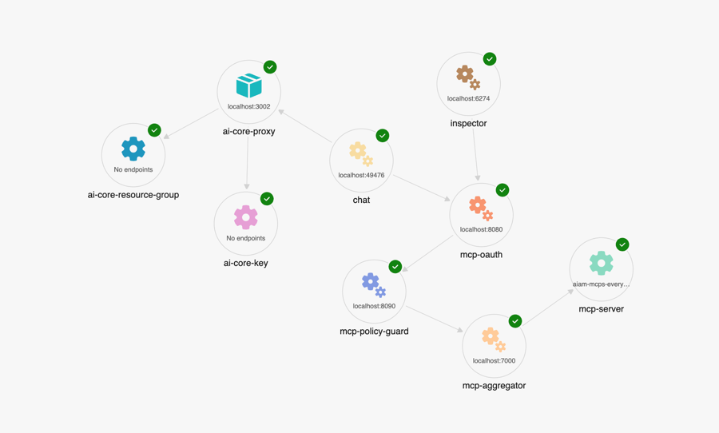

# Agent Application Programming (AAP)

Template repository with the user -> agent -> mcp-policy-guard -> mcp-aggregator -> multiple-mcp-servers chain, meant to ease deployments and integration of agents and aggregators with observability.

## Architecture Overview


```
┌─────────────────┐    ┌─────────────────┐    ┌─────────────────┐
│   Chat Client   │───▶│ MCP Policy Guard│───▶│ MCP Aggregator  │
│   (mcp-chat)    │    │ (mcp-policy-    │    │ (mcp-aggregator)│
└─────────────────┘    │   guard)        │    └─────────┬───────┘
         │             └─────────────────┘              │
         ▼                                              ▼
┌─────────────────┐    ┌─────────────────┐    ┌─────────────────┐
│   AI Core       │    │   Inspector     │    │  Multiple MCP   │
│   (mcp-ai-core) │    │ (mcp-inspector) │    │   Servers       │
└─────────────────┘    └─────────────────┘    └─────────────────┘
```


## Current Implementation


### MCP Policy Guard - Go MCP Proxy with OpenTelemetry
The system  includes a **Go-based MCP Proxy** that adds OpenTelemetry tracing only to the MCP requests, providing observability into the request flow without modifying the MCP protocol itself.
To be replaced with an actual gaurd implementation - via docker image or http url

The **MCP Proxy** (`/mcp-policy-gaurd/`) is a Go-based service that:
- **Forwards MCP requests** to the MCP Aggregator with policy enforcement
- **Adds OpenTelemetry tracing** to all requests for observability
- **Provides health checks** for Kubernetes deployments  
- **Injects trace context** into downstream requests for distributed tracing
- **Handles errors gracefully** with proper logging and span recording

Key features:
- Zero-modification proxy (preserves MCP protocol)
- Comprehensive tracing with span attributes
- Health (`/health`) and readiness (`/ready`) endpoints
- Kubernetes-ready with liveness/readiness probes
- Configurable via environment variables


### MCP  Aggregator - Python McP Proxy 
The current implementation provides a **placeholder** proxy to  demonstrates integration between different layers
Will be replaced with an actual aggregator implementation - via docker image or http url


[./guerd/main.py](./guerd/main.py) is a simple proxy that uses the `fastmcp` library to create a proxy server for the Model Context Protocol (MCP). It allows you to connect to an MCP server and provides a basic interface for interacting with it.
```python
# mcp-aggregator/main.py

...
config = getConfig()

# Create a proxy with full MCP feature support
proxy = FastMCP.as_proxy(
   ProxyClient(config),
   name=os.getenv("NAME", "mcp-aggregator")
)

# Run the proxy
if __name__ == "__main__":
   proxy.run(transport="http", host="0.0.0.0", port=os.getenv("PORT", 8080))
```

## MCP Inspector
To the MCP Server attached the MCP inspector, configured with the mcp-aggregator URL. This allows you to inspect the MCP server's tools and capabilities.

|  |    |
|--------------------------------------------|---|

### MCP Chat Agent

Simple basic agent API using copilotkit

|    |    |
|---|---|


[./agents/chat/main.tsx](./agents/chat/main.tsx) is a simple chat agent that uses the MCP server to process chat requests. It allows you to test the MCP server's capabilities by sending prompts and receiving responses.

```tsx
app.post("/chat", async (c) => {
   const body = await c.req.parseBody();
   const url = body.url as string;
   const prompt = body.prompt as string;

   const mcpClient = await createMcpClient({
      transport: new StreamableHTTPClientTransport(new URL(url)),
   });

   const tools = await mcpClient.tools();

   const {textStream, text} = await aiStreamText({
      model: azure("gpt-4o"),
      prompt,
      tools,
   });
   const s = textStream.pipeThrough(new TextDecoderStream());
   console.log("Streaming response from MCP server...", await text);

   return streamText(c, async (stream) => {
      for await (const chunk of s) {
         stream.write(chunk);
      }
      console.log("Streaming complete.");
   });
});

```

**Replace any part with your own implementation, such as the mcp-aggregator, the agent, or the MCP server URL,**


## Running the Application

1. **Build and Run**:
```bash
aspire run 
```

## Generate Helm Chart

```bash  
aspire generate helm --output ./helm
```

## Deployment helm to Kubernetes

```bash
helm install aspire-ai ./helm --namespace aspire-ai --create-namespace
```

## Development Guidelines

### Adding New Layers

1. **Create the layer project** following the  MCP protocol
2. **Implement layer-specific logic** using any langage or framework
3. **Add to Aspire AppHost** with proper chaining server config
4. **Configure environment variables** for layer behavior
5. **Test the layer** in isolation and in the chain


### Best Practices

- **Keep layers focused** on a single responsibility in a single domain - while providing the story whole
- **Use ProxyClient** for full MCP feature support
- **Implement proper error handling** and logging
- **Test layers independently** before chaining
- **Use environment variables** for configuration
- **Follow the MCP protocol** standards
- **Use session isolation** for concurrent safety


<!--
### Layer Responsibilities

- **Gateway Layer**: HTTP exposure, request routing, response handling
- **Authentication Layer**: Handle JWT tokens, OAuth flows
- **Policy Layer**: Enforce access policies, rate limiting
- **Interpolation Layer**: Token exchange, auth method abstraction
-->


