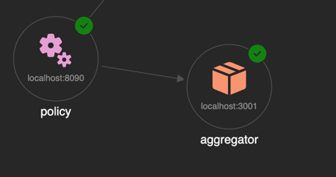

# SCAI INTEGRATION REFERENCE

This repository provides a reference implementation for integrating multiple MCP (Model Context Protocol) servers using Aspire AppHost. It includes various layers such as OAuth authentication, policy enforcement, and aggregation of multiple MCP servers.

Between the user and the MCP server, you can find the MCP Guard- a chain of multiple security layers to handle authentication, authorization, logging, and other functionalities.
 

# Resources Overview


[//]: # (![graph.png]&#40;docs/graph.png&#41;)

----
 
## SCAI Componnets: The MCP Guard 
> MCP Guard is an MCP proxy that protect downstream MCP servers with authentication, authorization, grant management and consents.

###### The Guard implemented with multiple layers, each implemented as its own MCP Proxy/middleware:
 - **OAuth**:  Supports OAuth2, API Key, and custom token-based authentication methods to verify client identities.
 - **Policy**: Enforces role-based and attribute-based access control to ensure clients can only access permitted resources and actions.
 - **Aggregation**: Combines multiple MCP servers, providing a unified interface for clients to interact with various server`s tools.

##### TBD
 - **Interploation** : 
  - **Audit**: Records detailed logs of all access and actions performed through the MCP Guard, facilitating auditing and compliance checks.
  - **Consent and Grants**: Manages user consents and permissions for accessing specific tools or data, ensuring compliance with user preferences.
  - **Session Management**: Maintains agent and user sessions, allowing for seamless interactions across multiple requests without repeated authentication.
<!--
- **Logging and Monitoring**: Integrates with logging and monitoring systems to track access patterns, detect anomalies, and generate audit trails for compliance purposes.
  - **Rate Limiting**: Controls the rate of incoming requests to prevent abuse and ensure fair usage among clients.
-->
---
### MCP OAuth Layer
> Provides MCP Proxy that handles OAuth2 authentication and token management.


You can find the source code on GitHub

[✏️ https://github.tools.sap/AIAM/mcp-oauth](https://github.tools.sap/AIAM/mcp-oauth)


#### API Endpoints
**draft**
-  [x] `POST /` - MCP request handling
-  [ ] `GET /health` - Health check endpoint
-  [ ] `POST /login` - OAuth2 login endpoint
-  [ ] `GET /oauth/callback` - OAuth2 callback endpoint
-  [ ] `POST /credentials` - Endpoint to set client credentials

`PORT 8080`

----

### MCP Policy 

> Provides MCP Proxy that evaluate and enforce fine-grained, dynamic AuthZ rules before downstream forwarding


You can find the source code on GitHub

[✏️ https://github.tools.sap/AIAM/mcp-guard/tree/i551404_testing](https://github.tools.sap/AIAM/mcp-guard/tree/i551404_testing)


#### API Endpoints
**draft**
-  [x] `POST /` - MCP request handling 
-  [ ] `GET /health` - Health check endpoint
-  [ ] `GET /policies` - View and manage policies
-  [ ] `POST /policies` - Add new policy

`PORT 8090`

----

### MCP Aggregator 

> Aggregates multiple MCP servers into a single endpoint.
  


You can find the source code on GitHub

[✏️ https://github.tools.sap/AIAM/mcp-aggregator](https://github.tools.sap/AIAM/mcp-aggregator) 


#### API Endpoints
**draft**


The MCP Aggregator exposes the following endpoint:

- [X] `POST /mcp` - MCP request handling
- [ ] `GET /health` - Health check endpoint
- [ ] `GET /servers` - List configured MCP servers
- [ ] `POST /servers` - Add new MCP server
- [ ] `DELETE /servers/{name}` - Remove MCP server

`PORT 3001`


#### Configuration

```json
{
    "mcpServers": {
      "github": {
        "type": "http",
        "url": "https://api.githubcopilot.com/mcp/"
      }, 
      "sequential-thinking": {
        "command": "npx",
        "args": [
          "-y",
          "@modelcontextprotocol/server-sequential-thinking"
      ] } } 
}
```
----

## Resources for Demo & Debug
### MCP Chat Agent

Simple basic agent API using copilotkit

|    |    |
|---|---|


[./agents/chat/main.tsx](./agents/chat/main.tsx) is a simple chat agent that uses the MCP server to process chat requests. It allows you to test the MCP server's capabilities by sending prompts and receiving responses.

-----

### MCP Inspector
To the MCP Server attached the MCP inspector, configured with the mcp-aggregator URL. This allows you to inspect the MCP server's tools and capabilities.

|  |    |
|--------------------------------------------|---|

----

**Replace any part with your own implementation, such as the mcp-aggregator, the agent, or the MCP server URL,**


## Running the Application

1. **Build and Run**:
```bash
aspire run 
```

## Generate Helm Chart

```bash  
aspire generate helm --output ./helm
```

## Deployment helm to Kubernetes

```bash
helm install aspire-ai ./helm --namespace aspire-ai --create-namespace
```

## Development Guidelines

### Adding New Layers

1. **Create the layer project** following the  MCP protocol
2. **Implement layer-specific logic** using any langage or framework
3. **Add to Aspire AppHost** with proper chaining server config
4. **Configure environment variables** for layer behavior
5. **Test the layer** in isolation and in the chain


### Best Practices

- **Keep layers focused** on a single responsibility in a single domain - while providing the story whole
- **Use ProxyClient** for full MCP feature support
- **Implement proper error handling** and logging
- **Test layers independently** before chaining
- **Use environment variables** for configuration
- **Follow the MCP protocol** standards
- **Use session isolation** for concurrent safety

### Screenshots

##### Resource Menu 


##### Markdown Documentation

##### Custom Commands


### Templates
- [Go MCP Layer](templates/mcp-layer-go/README.md)
- [Java MCP Layer](templates/mcp-layer-java/README.md)
- [Python MCP Layer](templates/mcp-layer-python/README.md)


<!--
### Layer Responsibilities

- **Gateway Layer**: HTTP exposure, request routing, response handling
- **Authentication Layer**: Handle JWT tokens, OAuth flows
- **Policy Layer**: Enforce access policies, rate limiting
- **Interpolation Layer**: Token exchange, auth method abstraction
-->


